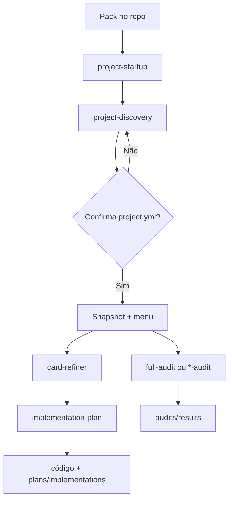

# Guia da pasta `.github/`

> **Este é o “README” desta pasta.**  
> Não se chama `README.md` de propósito: o GitHub prioriza `.github/README.md` sobre o [README da raiz](../README.md) e trocaria a home do repositório (produto Pulso) por este guia.

Aqui ficam **CI**, **Dependabot**, **epics/cards**, e o **pack de agents/skills** (Cursor, Copilot, Claude) — genérico o bastante para copiar para outro repo, com o produto ligado só via `project.yml` + overlay.

---

## Por onde começar

| Quero… | Abra |
|--------|------|
| Entender a pasta (você está aqui) | este arquivo |
| Saber **qual comando** rodar | [`COMMANDS.md`](./COMMANDS.md) |
| Usar no **Cursor / Copilot / Claude** | [`USAGE.md`](./USAGE.md) |
| Ver o contrato deste repo | [`project.yml`](./project.yml) |
| Ver epics do Pulso | [`plans/README.md`](./plans/README.md) |
| Rodar / entender auditorias | [`audits/README.md`](./audits/README.md) |

**Primeira frase no agent (repo novo ou pack acabou de chegar):**

```text
Faça o start-up deste repositório
```

Isso dispara `project-startup` → `project-discovery` propõe o `project.yml` → você confirma → menu do próximo passo.

---

## O que tem aqui (mapa)

```
.github/
├── INDEX.md                 ← guia da pasta (este arquivo)
├── COMMANDS.md              ← catálogo: o que rodar / quando / o que sai
├── USAGE.md                 ← setup por plataforma (Cursor, Copilot, Claude)
├── project.yml              ← contrato deste produto (Pulso)
├── project.example.yml      ← template para outro repo
├── project.schema.json      ← schema do contrato
├── dependabot.yml           ← deps (hoje: sem PRs automáticos)
├── labeler.yml              ← labels automáticos em PR
├── workflows/               ← CI + security scan
├── agents/                  ← personas (implementation-plan, mentoring)
├── skills/                  ← comandos invocáveis (startup, audits, docs…)
├── audits/                  ← prompts, overlay, scanners, results
├── plans/                   ← epics (cards) + planos de implementação
├── docs/                    ← blueprints gerados (opcional / legado)
└── instructions/            ← instruções Copilot geradas (opcional / legado)
```

| Pasta / arquivo | Função |
|-----------------|--------|
| [`agents/`](./agents/README.md) | Personas de longo prazo (plano faseado, mentoria) |
| [`skills/`](./skills/README.md) | Skills ativas + `_legacy/` |
| [`audits/`](./audits/README.md) | Prompts genéricos, overlay Pulso, scanners, resultados |
| [`plans/`](./plans/README.md) | Epics/stories e planos gerados |
| `workflows/` | Lint, test, build, `npm audit` |
| `project.yml` | Paths, locale, outputs, overlay — **única ponte** pack ↔ produto |

---

## Fluxo principal



Ordem típica do zero ao merge:

1. **start-up** — configura o repo  
2. **full-audit** (ou uma auditoria) — achados em `audits/results/`  
3. **card-refiner** — aperta o epic  
4. **implementation-plan** — plano + código fase a fase  
5. **readme-updater** / **plantuml** — docs e diagramas  

Detalhe de cada passo: [`COMMANDS.md`](./COMMANDS.md).

---

## Agents

| Agent | Arquivo | Para quê | Frase típica |
|-------|---------|----------|--------------|
| Implementation plan | [`agents/implementation-plan.agent.md`](./agents/implementation-plan.agent.md) | Card → plano faseado → implementar com gates humanos | *Implemente o card …* |
| Mentoring juniors | [`agents/mentoring-juniors.agent.md`](./agents/mentoring-juniors.agent.md) | Mentoria socrática (ensina, não entrega pronto) | *Me ajude a entender X como mentor* |

Índice: [`agents/README.md`](./agents/README.md).

---

## Skills (comandos)

Resumo — lista completa e frases-gatilho em [`COMMANDS.md`](./COMMANDS.md) e [`skills/README.md`](./skills/README.md).

| Grupo | Skills |
|-------|--------|
| Entrada | `project-startup`, `project-discovery` |
| Auditorias | `full-audit`, `po-audit`, `security-audit`, `devops-audit`, `dev-senior-review`, `ux-audit`, `architecture-audit` |
| Entrega | `card-refiner`, `project-architect` |
| Docs | `readme-updater`, `plantuml-diagram-generator` |
| Legado | `skills/_legacy/*` (blueprints greenfield) |

---

## Pack portátil vs. específico do Pulso

| Genérico (leva para outro repo) | Específico deste produto |
|---------------------------------|--------------------------|
| `agents/`, `skills/`, `audits/prompts/`, `audits/manifest.yml` | `project.yml`, `audits/overlays/pulso.md` |
| `project.example.yml`, `project.schema.json` | `plans/cards/`, resultados históricos |
| `COMMANDS.md`, `USAGE.md`, este `INDEX.md` | `workflows/` / Dependabot (ajuste por CI) |

Em outro repositório: copie o pack → diga *start-up* → confirme o `project.yml`. Overlay de domínio é opcional.

---

## Como usar (atalho)

| Ferramenta | Caminho rápido |
|------------|----------------|
| **Copilot** | Skills já em `.github/skills` — cite o nome no chat |
| **Cursor** | `@.github/skills/…/SKILL.md` **ou** junction para `.cursor/skills` |
| **Claude** | Peça para ler o `SKILL.md` / instruções do Project |

Passo a passo e troubleshooting: [`USAGE.md`](./USAGE.md).

---

## Convenções deste repo

- Prefixos RF/RNF e achados (`PO`, `SEC`, `OPS`, …): `conventions` em [`project.yml`](./project.yml)
- Saídas novas de auditoria: `outputs.audits` → `.github/audits/results/`
- Histórico PO já entregue: `Documentacao/03-Auditorias/` (não misturar)
- Cards: índice em [`plans/README.md`](./plans/README.md)

---

## Links úteis

| Doc | Conteúdo |
|-----|----------|
| [`COMMANDS.md`](./COMMANDS.md) | Catálogo de comandos |
| [`USAGE.md`](./USAGE.md) | Cursor · Copilot · Claude |
| [`audits/manifest.yml`](./audits/manifest.yml) | Mapa audit → skill → prompt → saída |
| [`audits/overlays/pulso.md`](./audits/overlays/pulso.md) | Contexto de domínio Pulso |
| [`../README.md`](../README.md) | Home do produto no GitHub |
| [`../Documentacao/README.md`](../Documentacao/README.md) | Docs de produto e engenharia |
