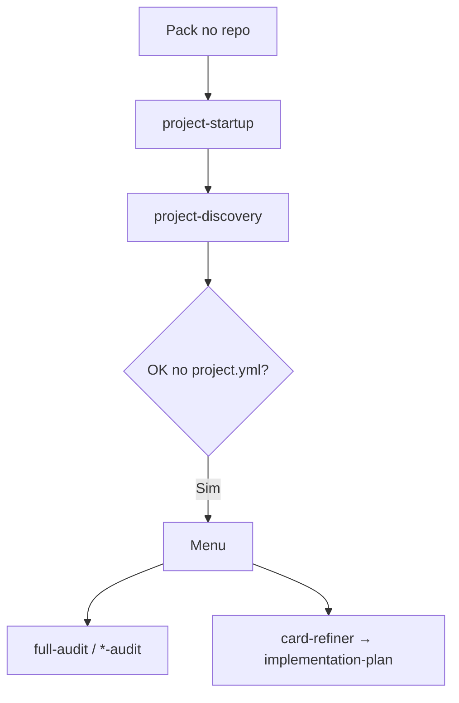

# Como usar o pack — Cursor, Copilot e Claude

Guia **só de plataforma** (paths e invocação).  
O que a pasta é, fluxos e agents: [`INDEX.md`](./INDEX.md).  
O que rodar e quando: [`COMMANDS.md`](./COMMANDS.md).

> **Não** crie `.github/README.md` — o GitHub usaria isso como home do repositório no lugar do [README da raiz](../README.md). O guia desta pasta é o `INDEX.md`.

---

## Manual vs. automático

| Item | Manual? | Quem cria |
|------|---------|-----------|
| `project.yml` | Só confirmar | `project-discovery` via `project-startup` |
| Overlay (`audits/overlays/*.md`) | Opcional | Você (domínio / RFs / LGPD) |
| Cards em `plans/cards/` | Depende do produto | Você / `card-refiner` |
| Workflows / Dependabot | Se a CI for outra | Ajuste local |

**Primeiro passo em qualquer ferramenta:** *Faça o start-up deste repositório*

---

## Cursor

Skills canônicas do Cursor: `.cursor/skills/<nome>/SKILL.md` (ou `.agents/skills/`).  
O Cursor **não** carrega `.github/skills` sozinho.

**Opção A — junction (PowerShell):**

```powershell
New-Item -ItemType Directory -Force -Path .cursor\skills | Out-Null
Get-ChildItem .github\skills -Directory |
  Where-Object { $_.Name -ne '_legacy' } |
  ForEach-Object {
    New-Item -ItemType Junction -Path ".cursor\skills\$($_.Name)" -Target $_.FullName -Force
  }

New-Item -ItemType Directory -Force -Path .cursor\agents | Out-Null
Copy-Item .github\agents\implementation-plan.agent.md .cursor\agents\implementation-plan.md -Force
Copy-Item .github\agents\mentoring-juniors.agent.md .cursor\agents\mentoring-juniors.md -Force
```

**Opção B — citar o arquivo:**

```text
@.github/skills/project-startup/SKILL.md Faça o start-up deste repositório
```

Use o modo **Agent** e frases de [`COMMANDS.md`](./COMMANDS.md).

---

## GitHub Copilot

Paths já batem com o pack:

| Tipo | Path |
|------|------|
| Skills | `.github/skills/<nome>/SKILL.md` |
| Agents | `.github/agents/<nome>.agent.md` |

No chat: cite o nome (`project-startup`, `full-audit`, agent `implementation-plan`) ou anexe o `SKILL.md` se a skill não aparecer no `/`.

---

## Claude (Code / Project / Desktop)

1. **Claude Code:** `Leia .github/skills/project-startup/SKILL.md e execute o start-up.`
2. **Project instructions:** aponte para `INDEX.md` + `COMMANDS.md` + `project.yml`; diga para não inventar paths.
3. **Cola direta:** cole o `SKILL.md` no chat e peça a tarefa.

---

## Fluxo (todas as plataformas)



---

## Troubleshooting

| Sintoma | Correção |
|---------|----------|
| Inventa pastas / RFs | Rodar `project-startup` |
| Cursor não vê skill | Junction (A) ou `@SKILL.md` (B) |
| Relatório sumiu | Conferir `outputs.audits` no `project.yml` |
| Home do GitHub errada | Remover `.github/README.md`; usar `INDEX.md` |
| Overlay ignorado | Path em `audits.overlay` desatualizado |

---

## Ver também

- [`INDEX.md`](./INDEX.md) — guia da pasta  
- [`COMMANDS.md`](./COMMANDS.md) — catálogo  
- [`skills/README.md`](./skills/README.md) · [`agents/README.md`](./agents/README.md)
