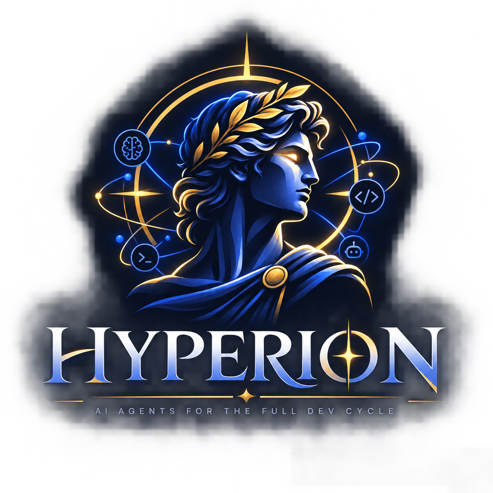

# 📚 Hyperion — índice de documentação

  

  
  
  
  

**Não leia tudo no dia 1.** Use este índice como guia de estudo.

| Badge | Para quem |
|-------|-----------|
|  | Chat + 6 comandos |
|  | GitHub, cards, repo |
|  | SDLC, CI, backends no **seu** produto |

---

## 1. Entender o produto

| Doc | O que responde |
|-----|----------------|
| [README.md](../../README.md) | O que é, áreas, skills, comandos |
| [GETTING-STARTED.md](../../GETTING-STARTED.md) | Glossário + primeiros passos |
| [trilha-de-aprendizado.md](./onboarding/trilha-de-aprendizado.md) | Ordem de estudo 🟢→🔵 · [EN](./onboarding/learning-path-en.md) |

## 2. Usar no dia a dia

| Doc | O que responde |
|-----|----------------|
| [comandos-rapidos.md](./reference/comandos-rapidos.md) | O que digitar no chat / npm |
| [catalogo-skills.md](./reference/catalogo-skills.md) | Cada skill: quando · comando · output |
| [armadilhas-comuns.md](./troubleshooting/armadilhas-comuns.md) | Erros frequentes |

## 3. Encaixar no seu repo

| Doc | O que responde |
|-----|----------------|
| [setup-github.md](./onboarding/setup-github.md) | Projects + `gh` |
| [adaptar-ao-repo.md](./onboarding/adaptar-ao-repo.md) | Repo legado → `/migrate` |
| [escolher-backend.md](./integration/escolher-backend.md) | Jira / Azure / Linear / GitLab |
| [node-and-docker.md](./meta/node-and-docker.md) | Sem Node no laptop |

## 4. Aprofundar

| Doc | O que responde |
|-----|----------------|
| [fluxo-completo.md](./meta/fluxo-completo.md) | SDLC ponta a ponta |
| [definition-of-done.md](./meta/definition-of-done.md) | Gates `*-verify` |
| [onde-ficam-os-outputs.md](./meta/onde-ficam-os-outputs.md) | Onde a IA grava arquivos |
| [skills-output-map.md](./reference/skills-output-map.md) | Mapa skill → pasta |

---

## Por pasta

| Pasta | Conteúdo |
|-------|----------|
| `onboarding/` | setup, trilha, adaptar-ao-repo |
| `reference/` | comandos, catálogo, cheatsheets |
| `integration/` | GitHub CLI, backends, pipeline |
| `quality/` | primeira auditoria |
| `troubleshooting/` | armadilhas |
| `meta/` | organização, fluxo, DoD, Node/Docker |

*Fonte:* [`hyperion-docs-map.mmd`](./assets/hyperion-docs-map.mmd)

Mapa de pastas do kit: [STRUCTURE.md](../STRUCTURE.md) · Contribuir: [CONTRIBUTING.md](../../CONTRIBUTING.md)
