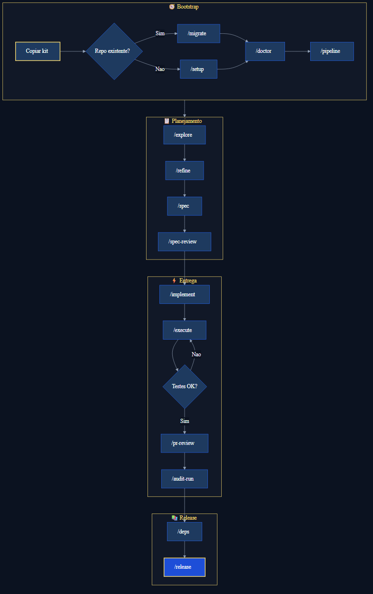

# 🗺️ Fluxo completo Hyperion

Mapa end-to-end: do zero ao release.

| Nível | O que focar |
|-------|-------------|
| 🟢 | Bootstrap + `/refine` + `/implement` + `/execute` |
| 🔵 | Diagrama completo abaixo (lead / time maduro) |

**English:** [full-flow-en.md](./full-flow-en.md)

---

## 👁️ Visão geral



Fonte: [`hyperion-journey-full.mmd`](../assets/hyperion-journey-full.mmd)

---

## 🚀 Fase 0 — Bootstrap (uma vez)

| Passo | Comando | Script npm | Output |
|-------|---------|------------|--------|
| Copiar kit | Manual | — | Seletivo — ver [README](../../../README.md) (não `project.yml` / `workflows` do kit) |
| Repo legado | `/migrate` | — | `.github/plans/migrations/` |
| Setup greenfield | `/setup` | `hyperion:setup -- --yes` | `project.yml`, cards config |
| Adaptar comandos | — | `hyperion:repo-detect` | Sugestão `commands.*` |
| Descobrir repo | `/discover` | — | `project.yml` atualizado |
| Saúde | `/doctor` | `hyperion:doctor` | *(chat)* |
| CI adaptável | `/pipeline` | `hyperion:pipeline-apply` | `hyperion-*.yml` workflows |
| GitHub CLI | Manual | `gh auth login` | Token para sync |

**Gates:** `hyperion:doctor` sem blockers · `projects-map.json` presente · workflows Hyperion instalados se `ci.hyperion.*` ativo.

---

## 📋 Fase 1 — Ideia → Cards

| Passo | Comando | Skill/Agent | Output |
|-------|---------|-------------|--------|
| Explorar hipótese | `/explore` | hypothesis-forge | `.github/memory/discoveries/` |
| Refinar em cards | `/refine` | card-refiner | `.github/cards/` + rollup |
| Spec BDD | `/spec` | acceptance-spec | `.github/plans/specs/` |
| Gate de spec | `/spec-review` | spec-review agent | `.github/plans/reviews/` |
| Sync board | `/sync` | hyperion-ops | GitHub/Jira/etc. |

**Gates:** spec-review **aprovado** antes de `/implement` · cards com frontmatter válido (`cards:validate`).

---

## ⚡ Fase 2 — Plano → Código → Testes

| Passo | Comando | Skill/Agent | Output |
|-------|---------|-------------|--------|
| Plano em fases | `/implement` | implementation-plan | `.github/plans/implementations/` |
| Executar fase | `/execute` | implementation-executor | Código + testes no repo |
| Estratégia de testes | `/test-plan` | testing-strategy | `.github/plans/specs/testing-strategy-*.md` |

### Loop de testes no executor (visão central)

O **implementation-executor** não termina uma fase sem:

1. Implementar arquivos da fase
2. Escrever/atualizar testes conforme plano
3. Rodar comando de teste do projeto (`commands.test` em `project.yml`)
4. Reportar output — falhas bloqueiam avanço
5. Gravar bloco **Verification** no plano (`tests_result: PASS|FAIL`)
6. Atualizar checkboxes no plano
7. Pedir aprovação humana para fase seguinte

Gate opcional (humano/CI):

```bash
npm run hyperion:phase-verify -- --plan .github/plans/implementations/<plano>.md
npm run hyperion:project-verify
npm run hyperion:review-verify -- --review .github/plans/reviews/<arquivo>.md
```

Gates completos: [definition-of-done.md](./definition-of-done.md).

Isso fecha o gap **"plano sem verificação"** — o fluxo de testes é **obrigatório dentro do agent de execução**.

---

## 🔍 Fase 3 — Qualidade → Release

| Passo | Comando | Skill/Agent | Output |
|-------|---------|-------------|--------|
| Auditoria orquestrada | `/audit-run` | audit-runner | `.github/audits/results/` |
| Auditoria avulsa | `/audit`, `/security`, … | *-audit skills | Por dimensão |
| Changelog | `/changelog` ou `/release` | changelog-generator / release | `CHANGELOG.md` |
| Dependências | `/deps` | dependency-health | `.github/audits/results/dependency/` |
| Revisão de PR | `/pr-review` | pr-reviewer | `.github/plans/reviews/pr-*` |
| Release | `/release` | release agent | Tag + checklist |

**Gates:** audit-runner sem blockers críticos · semver aprovado pelo humano · nunca tag/push sem confirmação.

---

## Onde cada output fica

Ver [skills-output-map.md](../reference/skills-output-map.md) e [onde-ficam-os-outputs.md](./onde-ficam-os-outputs.md).

---

## Comandos por persona

| Persona | Fluxo típico |
|---------|--------------|
| **PO / PM** | `/explore` → `/refine` → `/sync` → `/po` |
| **Dev** | `/spec-review` → `/implement` → `/execute` → `/pr-review` |
| **Tech lead** | `/architect` → `/adr` → `/audit-run` |
| **DevOps** | `/pipeline` → `/devops` → `hyperion:doctor` |
| **Mentor / onboarding** | `/mentor` → `/setup` → GETTING-STARTED |

---

## Próximo passo

[trilha-de-aprendizado.md](../onboarding/trilha-de-aprendizado.md) · [comandos-rapidos.md](../reference/comandos-rapidos.md)

Mantenedores do **repositório Hyperion** (não do seu produto): [CONTRIBUTING.md](../../../CONTRIBUTING.md)
