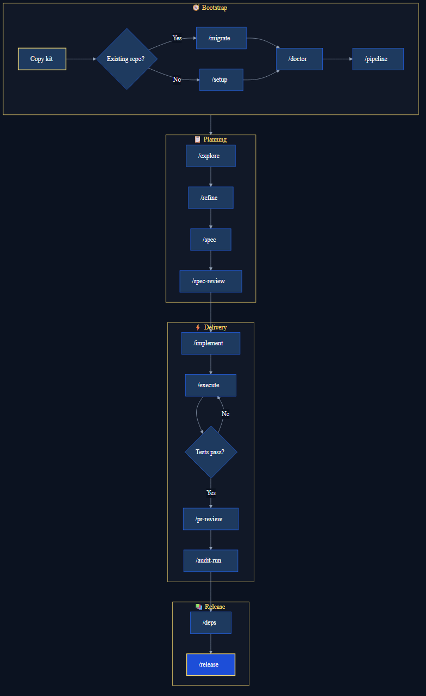

# 🗺️ Hyperion full flow

End-to-end map from zero to release.

| Level | Focus |
|-------|-------|
| 🟢 | Bootstrap + `/refine` + `/implement` + `/execute` |
| 🔵 | Full diagram below (lead / mature team) |

**Português:** [fluxo-completo.md](./fluxo-completo.md) · **Learning path:** [learning-path-en.md](../onboarding/learning-path-en.md)

---

## Overview



Source: [`hyperion-sdlc-full-en.mmd`](../assets/hyperion-sdlc-full-en.mmd)

---

## Phase 0 — Bootstrap

| Step | Command | Output |
|------|---------|--------|
| Copy kit | Manual | Selective — see [README](../../../README.md) (not kit `project.yml` / `workflows`) |
| Legacy repo | `/migrate` | `.github/plans/migrations/` |
| Greenfield | `/setup` | `project.yml`, cards |
| Adapt commands | `hyperion:repo-detect` | Suggested `commands.*` |
| Health | `/doctor` | *(chat)* |

See [adapt-repo-en.md](../onboarding/adapt-repo-en.md) and [skills-output-map.md](../reference/skills-output-map.md).

---

## Phase 1 — Idea → Cards

`/explore` → `/refine` → `/spec` → `/spec-review` → `/sync`

**Gate:** spec-review **approved** before `/implement`.

---

## Phase 2 — Plan → Code → Tests

`/implement` → `/execute` (uses `commands.test` from **your** `project.yml`)

After each phase, `/execute` writes a **Verification** block (`tests_result: PASS|FAIL`). Enforce with:

```bash
npm run hyperion:phase-verify -- --plan .github/plans/implementations/<plan>.md
npm run hyperion:project-verify
npm run hyperion:review-verify -- --review .github/plans/reviews/<file>.md
```

Full gates: [definition-of-done.md](./definition-of-done.md) (PT).

---

## Phase 3 — Quality → Release

`/pr-review` → `/audit-run` → `/deps` → `/release`

---

## Where outputs go

[skills-output-map.md](../reference/skills-output-map.md) · [where-outputs-go-en.md](./where-outputs-go-en.md)

---

## Next

[learning-path-en.md](../onboarding/learning-path-en.md) · [quick-commands-en.md](../reference/quick-commands-en.md)

Contributing to the Hyperion repo: [CONTRIBUTING.md](../../../CONTRIBUTING.md)
