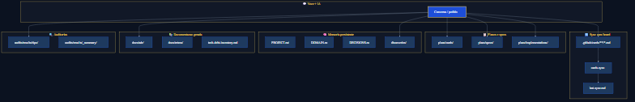

# 📁 Onde ficam os arquivos gerados?

Visão rápida. **Detalhe por skill:** [skills-output-map.md](../reference/skills-output-map.md) · **Quando usar:** [catalogo-skills.md](../reference/catalogo-skills.md)
**English:** [where-outputs-go-en.md](./where-outputs-go-en.md)

No clone limpo, pastas como `plans/` e `audits/results/` existem vazias até você usar os comandos que geram conteúdo.
Config: **`project.yml` → `outputs`**

---



---

## Por tipo (resumo)

| Artefato | Pasta | Sync board? |
|----------|-------|-------------|
| Cards (fonte) | `.github/cards/` | Sim |
| Specs / planos | `.github/plans/specs/`, `implementations/` | Não |
| Reviews / migrações | `.github/plans/reviews/`, `migrations/` | Não |
| Auditorias | `.github/audits/results/` | Não |
| ADR / retros | `.github/docs/adr/`, `retros/` | Não |
| Diagramas | `.github/diagrams/` | Não |

Tipos de diagrama (`/diagram`): ver [diagrams/README.md](../../diagrams/README.md).

---

## Customizar paths

```yaml
outputs:
  audits: .github/audits/results
  cards: .github/plans/cards
  implementations: .github/plans/implementations
  diagrams: .github/diagrams
```

---

## Ver também

- [skills-output-map.md](../reference/skills-output-map.md) — tabela completa skill → path
- [fluxo-completo.md](./fluxo-completo.md) — quando cada artefato entra no SDLC
