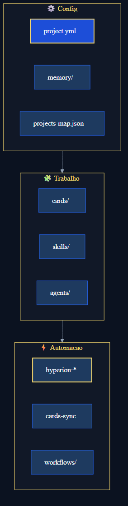

# Hyperion organization

Why the folder looks like this, what is essential, what you can ignore, and how to adopt it in **your** repo.

**Official repo:** [https://github.com/MatheusFelipeCorrea/Hyperion](https://github.com/MatheusFelipeCorrea/Hyperion) · **Português:** [organizacao.md](./organizacao.md) · **Structure map:** [STRUCTURE.md](../../STRUCTURE.md)

---

## Organization principles

1. **`.github/` = kit brain** — skills, agents, cards, audits, methodology docs.
2. **`scripts/` = deterministic automation** — sync, doctor, setup (agents delegate here).
3. **Runtime rules outside `.github/`** — `.cursor/rules/`, `CLAUDE.md`, `instructions/` (IDE-specific).
4. **Generated ≠ versioned** — plans, reviews, migrations, audits: gitignored; folders keep `.gitkeep`.
5. **Reference ≠ board** — `_examples/` and templates never sync to the Project board.

---

## What to copy into your project

| Copy | Required? |
|------|-----------|
| `.github/skills/`, `agents/`, `docs/`, `audits/`, `commands.yml`, `memory/`, clean `cards/`, `project.example.yml`, … | Yes (merge if it already exists) |
| `scripts/` | Yes |
| `hyperion:*` / `cards:*` scripts (**merge** into your `package.json`) | Recommended |
| `bin/` + `Dockerfile` | Without Node — [node-and-docker-en.md](./node-and-docker-en.md) |
| `.cursor/rules/` / `CLAUDE.md` | Per IDE |
| `.env.example` | Recommended |

**Do not copy:** this kit’s `.git/` · kit **`project.yml`** (use `project.example.yml`) · kit **`workflows/`** (use **`/pipeline`**) · generated artifacts.

---

## Safe to ignore day-to-day

| Item | Ignore? | Notes |
|------|---------|-------|
| `audits/prompts/*.md` | Yes (agent reads them) | Skill maintainers only |
| `SKILL.template.md` | Yes | Only when authoring a skill |
| `project.schema.json` | Almost | Used by project-discovery |
| `exemplars.md` | Yes until you have patterns | Optional per team |
| `STRUCTURE.md` | Kit folder map | Rare lookup |
| Full guide + EN pairs | Pick one locale | Don’t read everything |

---

## Intentional redundancy (not clutter)

| Layers | Why |
|--------|-----|
| 3 runtime rules | Cursor / Claude / Copilot — synced via `commands.yml` + `hyperion:generate-rules` |
| Prompt + skill per audit | Prompt = checklist; skill = orchestration + output path |
| PT + EN docs | Same meaning, different locales |
| `hyperion:*` + `cards:*` | Master vs granular (CI may call cards directly) |

Anti-duplication (Hyperion repo maintainers): [CONTRIBUTING.md](../../../CONTRIBUTING.md)

---

## Adopt in a monorepo / existing repo

1. Copy the kit from [Hyperion](https://github.com/MatheusFelipeCorrea/Hyperion) → **`/migrate`** (recommended) or merge `.github/` manually.
2. Review `project.yml` — especially `commands` and `management`.
3. `npm run hyperion:doctor` or **`/doctor`**.
4. Guide: [adapt-repo-en.md](../onboarding/adapt-repo-en.md).

---

## Upgrade the kit in a client repo (`hyperion:upgrade`)

Like `npm audit` / update: checks the GitHub origin (`.github/hyperion-origin.json`), compares to the local pin, applies the delta.

```bash
# In the CLIENT repo
npm run hyperion:upgrade              # check origin + show plan
npm run hyperion:upgrade -- --check   # exit 1 if behind
npm run hyperion:upgrade -- --yes     # shallow-clone + apply

# Offline / local path (optional)
npm run hyperion:upgrade -- --from /path/to/Hyperion --yes
```

Default origin: `hyperion-origin.json` (override: `--repo`, `--ref`, or `HYPERION_ORIGIN_REPO`).

**Updates:** kit scripts, skills, agents, docs, `hyperion-*` workflows, rules; merges `hyperion:`/`cards:` scripts.

**Preserves:** `project.yml`, `memory/`, `cards/`, `plans/`, board folders, `.env`.

Writes `.github/hyperion-kit.json` with `commit` + timestamp.

---

## Mental model (3 pillars)



---

## See also

- [common-pitfalls-en.md](../troubleshooting/common-pitfalls-en.md)
- [quick-commands-en.md](../reference/quick-commands-en.md)
- [skills-output-map.md](../reference/skills-output-map.md)
