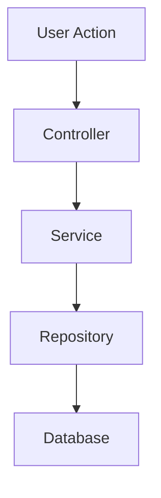

# Acceptance Spec — Behavioral Specification Generator

## When to use

- After a hypothesis-forge session with decision "Build"
- When a card/epic needs formal acceptance criteria before implementation
- When the team wants TDD-driven development from specs
- When documenting complex business logic as executable scenarios

## Context (read first)

1. `.github/memory/PROJECT.md` — project context
2. `.github/memory/DOMAIN.md` — entities and flows
3. `.github/memory/DECISIONS.md` — existing decisions
4. `.github/memory/discoveries/{DISC-ID}/` — related discovery (if exists)
5. `.github/project.yml` — stack hints, apps, conventions

## Phase 1 — Story Capture

Create `specs/{story-id}/story.md`:

```markdown
# {Story Title}

## Discovery
Link: .github/memory/discoveries/{DISC-ID}/ (if applicable)

## User Story
As a [persona],
I want [action],
so that [benefit].

## Acceptance Criteria (high-level)
- [ ] Criterion 1
- [ ] Criterion 2
- [ ] Criterion 3

## Out of Scope
- Item explicitly excluded
```

**STOP**: "Story and criteria OK? Can I generate the BDD spec?"

## Phase 2 — BDD Specification

Write `specs/{story-id}/spec.bdd.md`:

```markdown
# Spec BDD — {Story Title}

## Feature: {feature name}

### Scenario 1: {Happy path name}
Given [precondition]
And [additional context]
When [action]
Then [expected outcome]
And [additional verification]

### Scenario 2: {Edge case}
Given [precondition]
When [action with edge case]
Then [expected behavior]

### Scenario 3: {Error case}
Given [precondition]
When [invalid action]
Then [error handling]
And [user feedback]
```

Rules for scenarios:
- Each scenario is independent and deterministic
- Cover: happy path, edge cases, error cases, security cases
- Use domain language from `.github/memory/DOMAIN.md`
- Each scenario must be verifiable (testable)
- Order: happy path first, then edge, then error

**STOP**: "Spec OK? All scenarios covered? Can I generate tasks?"

## Phase 3 — Task Breakdown

Write `specs/{story-id}/tasks.md`:

```markdown
# Tasks — {Story Title}

## From Spec

| # | Scenario | Task | Layer | Complexity |
|---|----------|------|-------|------------|
| 1 | Scenario 1 | Implement happy path logic | Service | Medium |
| 2 | Scenario 1 | Add validation | Schema | Low |
| 3 | Scenario 2 | Handle edge case X | Service | Low |
| 4 | Scenario 3 | Error handling + response | Controller | Low |

## Implementation Order
1. Data layer (models/schemas)
2. Business logic (services)
3. API layer (controllers/routes)
4. UI layer (if applicable)
5. Integration tests
```

## Phase 4 — Blueprint (conditional)

If the feature has more than 2 steps in its flow, generate a Mermaid diagram:

Write `specs/{story-id}/blueprint.mermaid`:



Only generate if the flow is complex enough to benefit from visualization.

For **project-wide** sequence, activity, state, and ER diagrams, use `/diagram` (`plantuml-generator`) — see `.github/diagrams/README.md`.

## Output

| Artifact | Path |
|----------|------|
| Story folder | `.github/plans/specs/{story-id}/` |
| `story.md` | `.github/plans/specs/{story-id}/story.md` |
| `spec.bdd.md` | `.github/plans/specs/{story-id}/spec.bdd.md` |
| `tasks.md` | `.github/plans/specs/{story-id}/tasks.md` |
| `blueprint.mermaid` (optional) | `.github/plans/specs/{story-id}/blueprint.mermaid` |

Read `project.yml` → `outputs` if specs path is customized. `{story-id}` format: `{PROJECT}-{NNN}-{slug}` (e.g. `PULSO-042-user-login`).

## Rules

- Spec is the contract. No implementation without approved spec.
- Each scenario must map to at least one test when implemented.
- Do not mix responsibilities — one feature per spec file.
- If ambiguity arises, ask before assuming.
- Match the user's language for scenarios and descriptions.
- Reference the discovery when one exists.
- Keep scenarios KISS — simple and focused.
