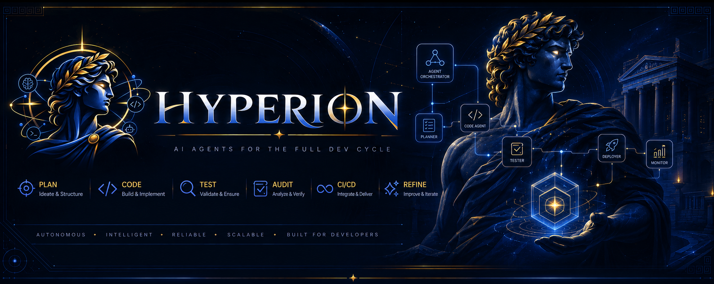

<p align="center">
  
</p>

<p align="center">
  <a href="LICENSE"></a>
  <a href="https://github.com/MatheusFelipeCorrea/Hyperion"></a>
  <a href="https://github.com/MatheusFelipeCorrea/Hyperion/actions/workflows/hyperion-validate.yml"></a>
  
  
</p>

<p align="center">
  
  
  
  
</p>

<p align="center">
  <a href="./GETTING-STARTED.md"></a>
  <a href="./.github/docs/reference/catalogo-skills.md"></a>
  <a href="./.github/docs/reference/comandos-rapidos.md"></a>
  <a href="./.github/docs/onboarding/learning-path-en.md"></a>
</p>

---

## Sumário

1. [O que é](#o-que-é-o-hyperion)
2. [Mapa rápido](#mapa-rápido--onde-usar)
3. [Skills por área](#skills-por-área--o-que-fazem)
4. [Comandos](#comandos--o-que-digitar-no-chat)
5. [Quickstart](#quickstart)
6. [Guia de estudo](#guia-de-estudo)
7. [Compatibilidade](#compatibilidade)
8. [npm (opcional)](#npm-opcional)
9. [Contribuir](#contribuir)

---

## O que é o Hyperion?

**Hyperion** é um kit que você **copia para o seu repositório**. A IA (Cursor, Claude, Copilot) lê os arquivos do kit e passa a seguir receitas prontas — do setup ao release.

| Sem Hyperion | Com Hyperion |
|--------------|--------------|
| Você explica o processo toda vez no chat | Você digita **`/refine`**, **`/implement`**, **`/execute`** |
| Cards, specs e reviews ficam soltos | Artefatos vão para pastas padrão (`.github/cards`, `plans`, `audits`) |
| Board e código não conversam | **`/sync`** sobe cards para GitHub / Jira / Azure / Linear / GitLab |

> Não é um app na nuvem. É **Markdown + scripts** no seu repo. Você fala no **chat**; o terminal (`npm` / Docker) é opcional.

---

## Mapa rápido — onde usar

Cinco áreas. Cada uma tem comandos no chat e skills por trás.

| | Área | Você usa quando… | Comandos típicos |
|---|------|------------------|------------------|
| 🧭 | **Bootstrap** | Ligar o kit, saúde, CI, board | `/setup` · `/migrate` · `/doctor` · `/pipeline` · `/sync` |
| 📋 | **Planejamento** | Ideia → cards → spec | `/explore` · `/refine` · `/spec` · `/spec-review` |
| ⚡ | **Entrega** | Plano, código, PR | `/implement` · `/execute` · `/pr-review` · `/test-plan` |
| 🔍 | **Qualidade** | Auditar produto / código / ops | `/audit` · `/security` · `/architecture` · `/deps` |
| 📚 | **Docs & release** | Diagramas, ADR, changelog, tag | `/diagram` · `/adr` · `/changelog` · `/release` |

Fluxo visual do dia a dia:

<p align="center">
  
</p>

Trilha completa: [fluxo-completo.md](./.github/docs/meta/fluxo-completo.md) · Estudo por nível: [trilha-de-aprendizado.md](./.github/docs/onboarding/trilha-de-aprendizado.md)

---

## Skills por área — o que fazem

**Skill** = receita curta (`SKILL.md`) que a IA segue uma vez.  
**Agent** = fluxo longo (`.agent.md`) com pausas para você aprovar.


### 🧭 Bootstrap / setup

| Skill / agent | Comando | Faz o quê |
|---------------|---------|-----------|
| project-startup | `/setup` | Setup guiado no repo novo |
| migration *(agent)* | `/migrate` | Adapta o kit a repo que já tem código |
| hyperion-ops | `/doctor` | Saúde do kit + cards (roda scripts) |
| project-discovery | `/discover` | Mapeia stack e gera `project.yml` |
| pipeline-architect | `/pipeline` | CI Hyperion adaptável ao seu pipeline |
| cards-sync-setup | `/cards-setup` | Configura sync com o board |
| integration-bridge | `/connect` | Liga Jira / Azure / Linear / GitLab |
| mentoring *(agent)* | `/mentor` | Ensino socrático do kit / fluxo |

### 📋 Planejamento

| Skill | Comando | Faz o quê |
|-------|---------|-----------|
| hypothesis-forge | `/explore` | Explora ideia antes de virar card |
| card-refiner | `/refine` | Ideia → épicos / features / stories |
| acceptance-spec | `/spec` | Spec Given/When/Then |
| project-architect | `/architect` | Blueprint greenfield |
| refactor-guide | `/refactor` | Plano de refactor seguro |
| sprint-retro | `/retro` | Retrospectiva |

### ⚡ Entrega (agents + skills)

| Skill / agent | Comando | Faz o quê |
|---------------|---------|-----------|
| implementation-plan *(agent)* | `/implement` | Plano em fases (você aprova) |
| implementation-executor *(agent)* | `/execute` | Código + testes da fase |
| pr-reviewer *(agent)* | `/pr-review` | Revisa PR aberto |
| testing-strategy | `/test-plan` | Estratégia de testes |
| spec-review *(agent)* | `/spec-review` | Gate de spec antes de codar |

### 🔍 Qualidade

| Skill / agent | Comando | Faz o quê |
|---------------|---------|-----------|
| full-audit | `/audit` | 6 dimensões de uma vez |
| audit-runner *(agent)* | `/audit-run` | Auditoria orquestrada com gates |
| security / architecture / devops / po / ux / code-review | `/security` · `/architecture` · … | Dimensão única |
| dependency-health | `/deps` | Dependências desatualizadas / risco |
| tech-debt-tracker | `/tech-debt` | Inventário de dívida |

### 📚 Docs & release

| Skill / agent | Comando | Faz o quê |
|---------------|---------|-----------|
| plantuml-generator | `/diagram` | Pacote UML em `.github/diagrams/` |
| adr-generator | `/adr` | Architecture Decision Record |
| changelog-generator | `/changelog` | CHANGELOG |
| readme-updater | `/readme` | Atualiza README(s) |
| release *(agent)* | `/release` | Changelog + versão + tag |

📄 **Lista completa (quando · output · link do SKILL):** [catalogo-skills.md](./.github/docs/reference/catalogo-skills.md)

---

## Comandos — o que digitar no chat


### 🟢 Primeira semana (memorize estes 6)

| # | No chat | Resultado |
|---|---------|-----------|
| 1 | **`/setup`** ou **`/migrate`** | Kit ligado ao seu repo |
| 2 | **`/doctor`** | O que falta (gh, token, cards…) |
| 3 | **`/refine`** | Sua ideia vira cards |
| 4 | **`/implement`** | Plano em fases |
| 5 | **`/execute`** | Código + testes |
| 6 | **`/help`** | Lista o restante |

Repo **novo** → `/setup`. Repo **já tem código** → `/migrate`.  
Se o `/` não aparecer no Cursor, diga a frase: *“Configura o Hyperion neste repo”*.

### 🟡 Quando precisar

| Situação | Comando |
|----------|---------|
| Subir cards pro board | `/sync` |
| Spec antes de codar | `/spec` · `/spec-review` |
| Revisar PR | `/pr-review` |
| Auditoria | `/audit` (rápida) ou `/audit-run` (com gates) |
| Dependências / release | `/deps` · `/release` |
| Diagramas | `/diagram` |

💬 **Todas as frases + npm:** [comandos-rapidos.md](./.github/docs/reference/comandos-rapidos.md)

---

## Quickstart

```bash
git clone https://github.com/MatheusFelipeCorrea/Hyperion.git
```

| # | Passo | Ação |
|---|--------|------|
| 1 | **Obter** | Clone ou ZIP → pasta **`Hyperion`** |
| 2 | **Colar** | Coloque a pasta **inteira** em `seu-produto/Hyperion/` |
| 3 | **Shims** | Na raiz do produto: `npm run hyperion:init --prefix Hyperion -- --adopt` |
| 4 | **Usar** | Chat no **produto**: `/setup` ou `/migrate` |

<details>
<summary><strong>📦 Detalhes (pasta Hyperion + o que fica na raiz)</strong></summary>

**Preferido:** não espalhar skills/scripts na raiz do produto.

| Em `seu-produto/Hyperion/` | Shims só na raiz do produto |
|----------------------------|-----------------------------|
| Kit completo (`.github/skills`, cards, scripts, `Dockerfile`, …) | `CLAUDE.md`, `.cursor/rules/hyperion.mdc`, `.github/project.yml` com `kit.root: Hyperion` |
| Artefatos do agente (cards, plans, audits) | Workflows `hyperion-*` **opcionais** (`ci.policy: skip` se já tem CI) |

Legado (ainda suportado): copiar seletivo `.github/…` na raiz — ver GETTING-STARTED.

</details>

Guia passo a passo: **[GETTING-STARTED.md](./GETTING-STARTED.md)**

---

## Guia de estudo

| Quero… | Abra |
|--------|------|
| 🚀 Entender e rodar na prática | [GETTING-STARTED.md](./GETTING-STARTED.md) |
| 📗 Estudar por nível 🟢🟡🔵 | [trilha-de-aprendizado.md](./.github/docs/onboarding/trilha-de-aprendizado.md) |
| 🧩 Ver **todas** as skills | [catalogo-skills.md](./.github/docs/reference/catalogo-skills.md) |
| 💬 Ver **todos** os comandos | [comandos-rapidos.md](./.github/docs/reference/comandos-rapidos.md) |
| ⚠️ Evitar erros comuns | [armadilhas-comuns.md](./.github/docs/troubleshooting/armadilhas-comuns.md) |
| 🗺️ Índice completo | [.github/docs/README.md](./.github/docs/README.md) |

Mais tarde: [setup GitHub](./.github/docs/onboarding/setup-github.md) · [adaptar repo](./.github/docs/onboarding/adaptar-ao-repo.md) · [Node/Docker](./.github/docs/meta/node-and-docker.md) · [Definition of Done](./.github/docs/meta/definition-of-done.md)

---

## Compatibilidade

| Runtime | Arquivo no kit |
|---------|----------------|
| Cursor | `.cursor/rules/hyperion.mdc` |
| Claude Code | `CLAUDE.md` |
| GitHub Copilot | `.github/instructions/copilot-instructions.md` |

---

## npm (opcional)

No dia a dia o **chat basta**. Terminal/CI:

```bash
npm run hyperion:doctor
npm run hyperion:setup -- --yes
npm run hyperion:sync
./bin/hyperion doctor
```

[Node/Docker](./.github/docs/meta/node-and-docker.md) · [GitHub CLI](./.github/docs/integration/github-cli-setup.md)

---

## Contribuir

Melhorias no **repositório Hyperion**: [CONTRIBUTING.md](./CONTRIBUTING.md) · [Code of Conduct](./CODE_OF_CONDUCT.md) · [Security](./SECURITY.md) · [Support](./SUPPORT.md) · [Changelog](./CHANGELOG.md)

Issues boas para começar: filtre por [`good first issue`](https://github.com/MatheusFelipeCorrea/Hyperion/issues?q=is%3Aissue+is%3Aopen+label%3A%22good+first+issue%22).

## Licença

[MIT](LICENSE)

---

<p align="center">
  
</p>
